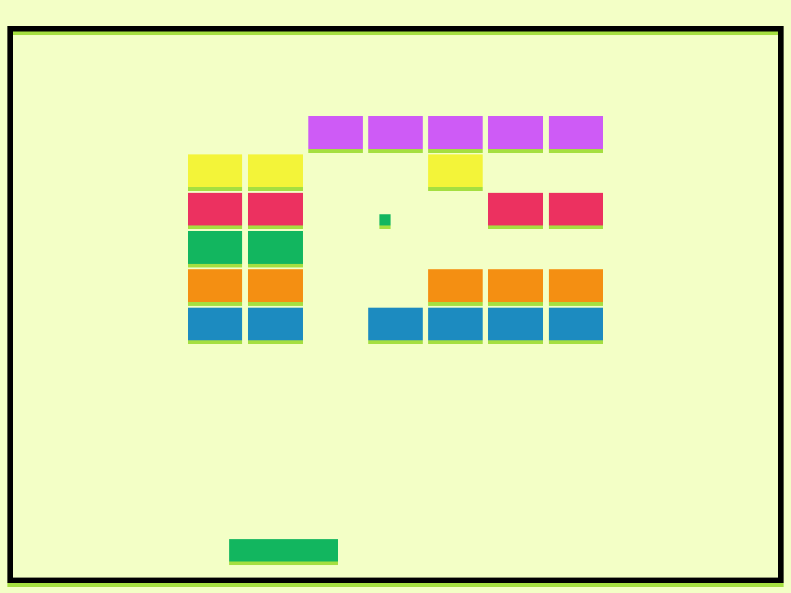

# Breakout Color

Author: Harleigh Awner

Design: Breakout/brickbreaker, but the colors matter! Bricks only break when they match the color of the ball, and bricks of complementary color let the ball pass through.

Screen Shot:

How To Play:

- Mouse click to start the round.
- Space bar to change the color of the paddle.
- The ball will match the color of the paddle upon colliding with it.
- If the ball matches the color of the brick, it will break.
- If the ball's color is complementary to the brick, it will pass through.
- All other bricks act like walls.
- Don't let the ball touch the ground!

Complementary colors (in case you never took an art class):

RED / GREEN

YELLOW / PURPLE

BLUE / ORANGE

This game was built with [NEST](NEST.md).
